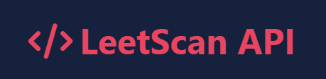

# 🚀 LeetScan API



[](https://github.com/chinxcode/leetScan-api/stargazers)
[](https://github.com/chinxcode/leetScan-api/network)
[](https://github.com/chinxcode/leetScan-api/issues)

> LeetScan API fetches and displays profile data from LeetCode, allowing developers to access key statistics and recent activities.

LeetScan API is a powerful tool for fetching and analyzing data from LeetCode user profiles. It provides developers, recruiters, and coding enthusiasts with detailed insights into a user's coding activity, problem-solving statistics, and contest performance. This API is designed for easy integration with other systems and offers robust data access features.

## 🌟 Features

-   🔍 **Profile Data Retrieval**: Fetch comprehensive LeetCode user profiles with detailed problem-solving statistics.
-   📊 **Contest and Submission Stats**: Access a user's contest rankings, total submissions, and recent activities.
-   🔢 **Multiple User Profiles**: Fetch data for multiple users in a single request.
-   🔒 **Rate Limiting**: Built-in rate limiting to handle multiple requests safely and prevent abuse.
-   🔌 **Easy Integration**: RESTful API that can be integrated into any platform or application.
-   📱 **Responsive Documentation**: Interactive and mobile-friendly API documentation.

## 📚 API Documentation

### Get Single Developer Profile

```
GET /:username
```

Replace `:username` with the LeetCode username.

#### Response Example

```json
{
  "username": "codingwizard",
  "totalSolved": 100,
  "totalSubmissions": 150,
  "totalQuestions": 1500,
  "easySolved": 50,
  "totalEasy": 500,
  "mediumSolved": 30,
  "totalMedium": 750,
  "hardSolved": 20,
  "totalHard": 250,
  "ranking": 5000,
  "contributionPoints": 500,
  "reputation": 1000,
  "submissionCalendar": {...},
  "profile": {
    "realName": "John Doe",
    "aboutMe": "Passionate coder",
    "userAvatar": "https://example.com/avatar.jpg",
    "location": "New York",
    "skillTags": ["Python", "JavaScript", "Algorithms"],
    "websites": ["https://johndoe.com"],
    "company": "Tech Corp",
    "school": "Code University",
    "starRating": 4.5
  },
  "recentSubmissions": [...],
  "badges": [...],
  "contestRanking": {
    "attendedContestsCount": 10,
    "rating": 1800,
    "globalRanking": 1000,
    "totalParticipants": 10000,
    "topPercentage": 10,
    "badge": {
      "name": "Knight",
      "icon": "https://example.com/knight.png"
    }
  }
}
```

### Get Multiple Developer Profiles

```
POST /multi
```

Send a POST request with a JSON body containing an array of usernames:

```json
{
    "usernames": ["user1", "user2", "user3"]
}
```

The response will be an array of profile objects, each following the structure of the single profile response.

## 🛠️ Technologies Used

-   **Node.js**
-   **Express.js**
-   **GraphQL** for fetching LeetCode data
-   **HTML/CSS/JavaScript** for interactive documentation

## 🚀 Quick Start

Follow these steps to get started with LeetScan API:

1. Clone the repository:

    ```bash
    git clone https://github.com/chinxcode/leetScan-api.git
    ```

2. Install dependencies:

    ```bash
    cd leetScan-api
    npm install
    ```

3. Start the server:

    ```bash
    npm start
    ```

4. Access the API documentation:
   Open `http://localhost:8000` in your web browser to view the interactive API documentation.

5. Make your first API call:
    ```bash
    curl http://localhost:8000/leetcode_username
    ```

## 📖 Documentation

For more detailed information about the API, including request/response formats and error handling, visit the interactive documentation at the root URL of your deployed API.

## 🤝 Contributing

Contributions, issues, and feature requests are welcome! Feel free to check the [issues page](https://github.com/chinxcode/leetScan-api/issues).

## 📝 License

This project is [MIT](https://opensource.org/licenses/MIT) licensed.

---

<p align="center">
  Made with ❤️ by <a href="https://github.com/chinxcode">Sachin Sharma</a>
</p>
